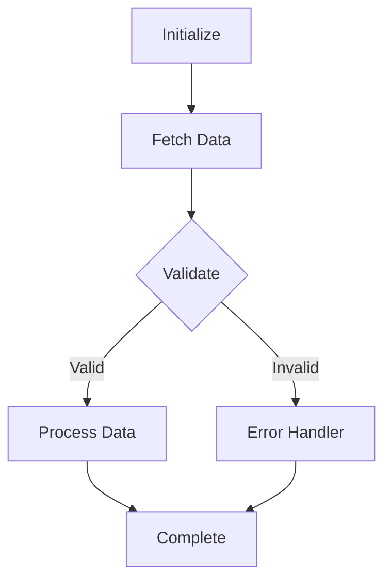

# Agentic FSM Orchestrator

## Overview

In complex multi-agent workflows, fully autonomous agents can suffer from state drift, infinite loops, or unpredictable behavior. The Agentic Finite State Machine (FSM) Orchestrator skill enforces a deterministic state machine over agent transitions. By defining explicit states, inputs, and transition criteria, you ensure that the system executes reliably and predictably while still leveraging LLM intelligence within individual states.

## Dependencies

- Python 3.10 or higher
- `templates/fsm_orchestrator.py` (companion executable script)

## Quick Start

To utilize the FSM Orchestrator, define your states and transitions in a configuration or directly in code using the FSM template. Here is a basic example:

```python
from fsm_orchestrator import StateMachine, State

# Define transition functions
def check_validation(context):
    if context.get("data_valid"):
        return "process"
    return "correct_data"

# Create state machine
fsm = StateMachine()
fsm.add_state(State("fetch_data", on_enter=fetch_action))
fsm.add_state(State("validate_data", transition_fn=check_validation))
```

## FSM State Definitions

Deterministic orchestration requires clear delineation of roles:

1. **State**: A discrete step in the business logic (e.g., `RetrieveQuery`, `AssessSafety`, `SynthesizeResponse`).
2. **Transition Function**: Evaluates the output of a state against predefined schemas to select the next state.
3. **Context**: A shared, thread-safe memory registry updated by each state.

### State Transition Schema



## Common Mistakes

- **Loose Transition Criteria**: Allowing the LLM to choose the next state using raw text. Transitions must be driven by parsed schemas or exact string matching.
- **Infinite Looping**: Uncapped state loops (e.g., state A fails, goes to B, B goes back to A). Always implement a loop counter or max retry limit in the shared context.
- **Context Bloat**: Storing massive raw documents in the shared state context. Keep the context lightweight, saving large assets to disk and passing file paths instead.
