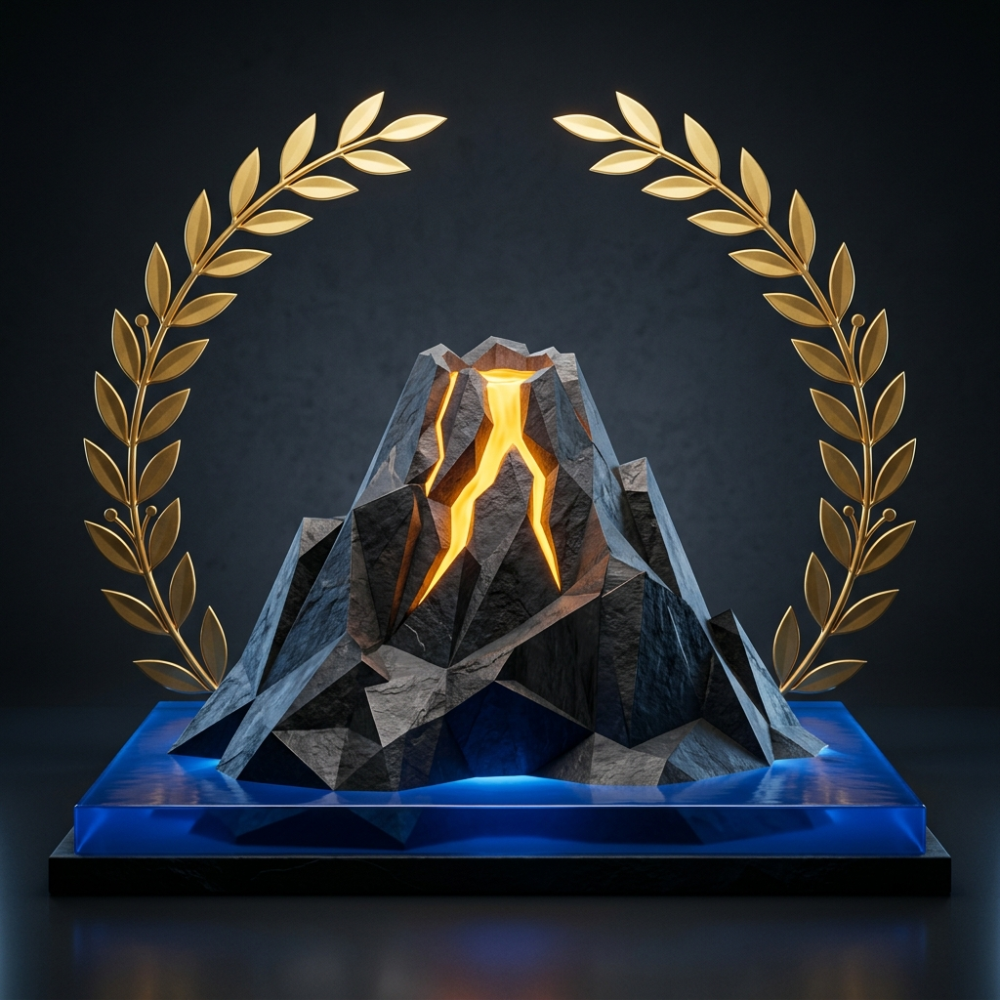
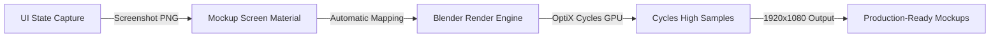

<div align="center">
  
  
  # VIBECODER-KIT-SURVIVAL
  
  ### The Ultimate Visual and Rendering Pipeline for High-Velocity Vibe Coders
  
  [](#)
  [](#)
  [](#)
  [](#)
  [](LICENSE)
</div>

---

## The Vision

Welcome to the survival kit for modern **Vibe Coders** - the high-agency developers who leverage LLMs, autonomous agents, and GPU-accelerated rendering engines to deploy premium, interactive projects at extreme velocity. 

We cut out the developer bloat and boilerplate. No complex enterprise SaaS patterns for simple mockups: only raw, surgical, goal-driven execution designed to convert attention into value.

---

## Design System & Tipography

To maintain the premium visual density of our digital outputs, we adhere strictly to our elite typographic principles:
*   **Titles & Display:** **Outfit** (Elegant, modern geometric sans)
*   **Body Copy:** **Plus Jakarta Sans** (Highly legible, sophisticated, clean)
*   **Palette:** Rich dark background with popping visual accentuation (Argilla & Gold)

---

## Visual Pipeline

Below is the conceptual pipeline illustrating how visual assets flow from state captures into high-fidelity 3D mockups:



---

## Hardware-Accelerated Rendering Core

The engine features a fully automated Blender scripting wrapper (`blender_render_mockup.py`) customized for high-speed, Cycles OptiX-accelerated GPU renders (specifically optimized for NVIDIA RTX series).

### Render Automation Key Highlights
*   **OptiX-Native Path:** Direct GPU-accelerated path configuration with automatic CUDA fallbacks.
*   **Dynamic Material Node Mapping:** Locates or dynamically instantiates the `MockupScreen` material and links image textures directly into the Principled BSDF node.
*   **Denoising Automation:** Seamless configuration of OptiX Denoising or OpenImageDenoise depending on system capability.

---

## Quick Start

### 1. Prerequisites
Ensure Blender 4.1+ is installed and accessible on your system PATH.

### 2. Rendering a Mockup
To replace a device screen mockup with a newly generated UI screenshot:

```bash
blender --background mockup_scene.blend --python blender_render_mockup.py -- --image ./path/to/screenshot.png --output ./path/to/output.png
```

#### Arguments
*   `--image`: Absolute or relative path to the source screenshot.
*   `--output`: (Optional) Desired output file path (defaults to standard render directory).

---

## Core Guidelines (Karpathy Behavioral Alignment)

We operate on a strict high-performance checklist to guarantee minimal code footprints and maximum execution:
1.  **Think Before Coding:** Declare assumptions and expose trade-offs immediately. Do not make silent architecture decisions.
2.  **Simplicity First:** Minimized footprint. If a script can be written in 50 lines instead of 200, it must be rewritten in 50.
3.  **Surgical Changes:** Modify only the necessary files. Avoid refactoring unrelated styles or comments.
4.  **Goal-Driven Verification:** Test scripts and API mocks before touching final production routes.

---

## License

This project is licensed under the MIT License: see the [LICENSE](LICENSE) file for details. Created with passion by Salvatore Laezza (Laber Company - 2026).
